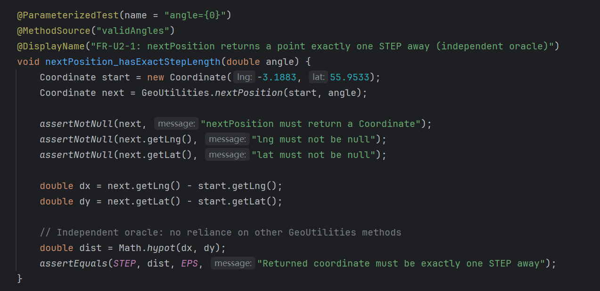
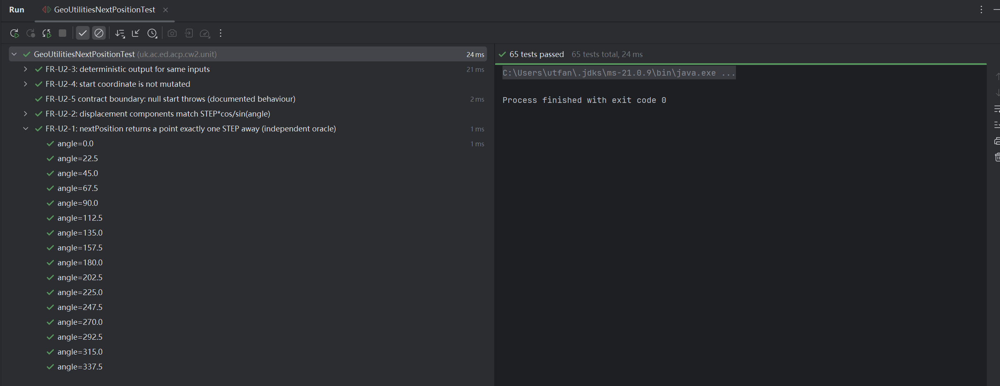
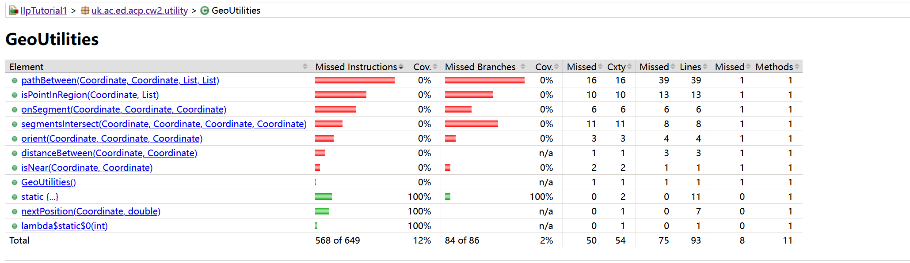
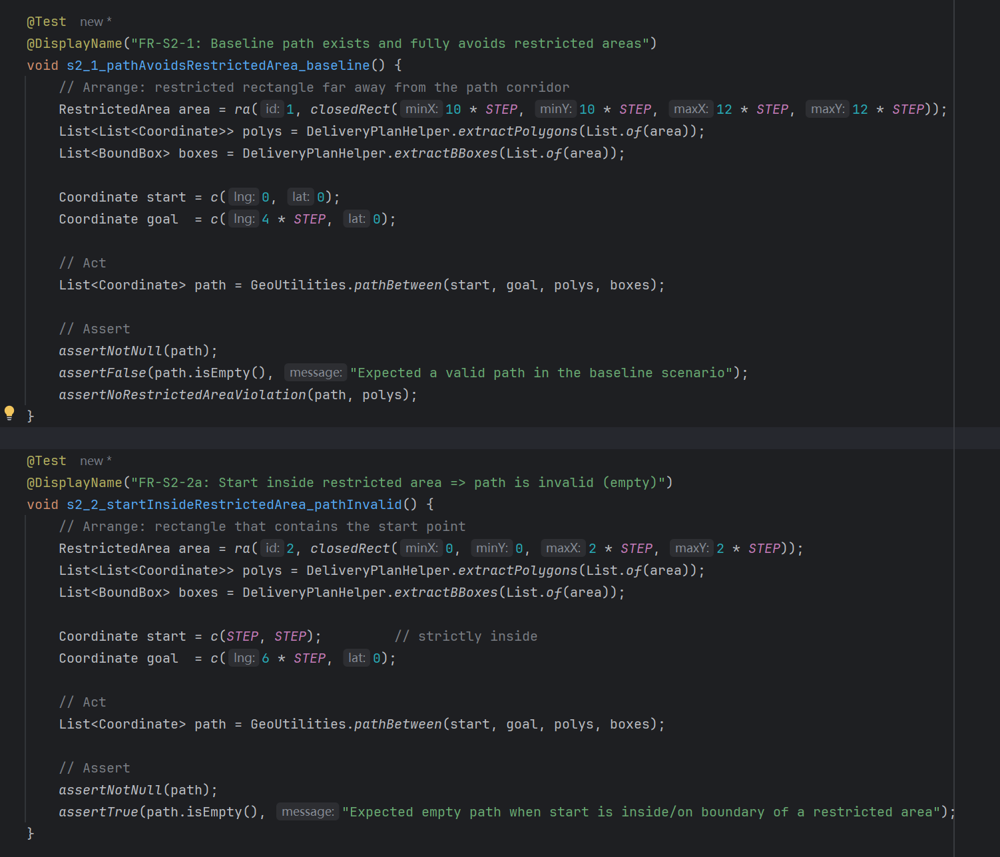
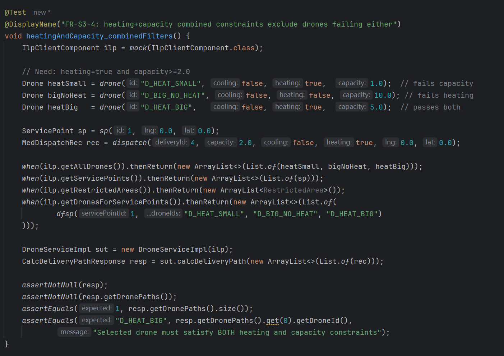
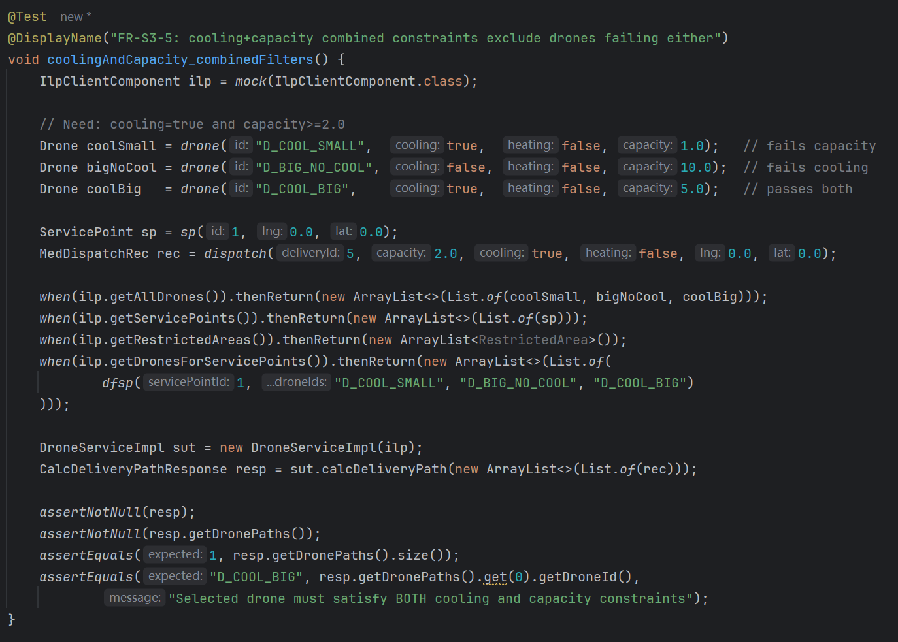
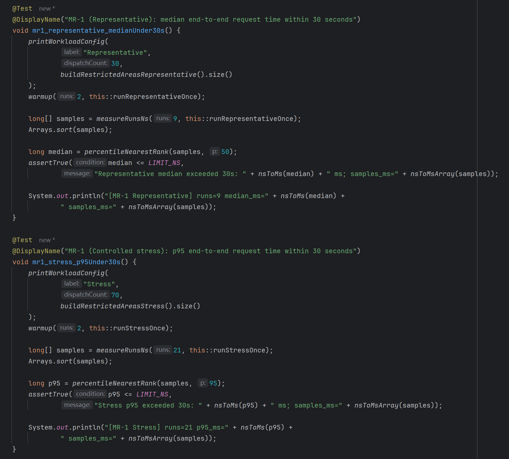

# LO3 Evidence — Evaluation of Testing

## Scope and Purpose

This document evaluates the adequacy and outcomes of the testing activities carried out
for the ILP Drone Delivery Microservice.

The purpose is **not** to claim full system correctness, but to assess how effectively
the executed tests provide confidence that selected requirement properties hold within
the defined testing scope.

The evaluation covers the following requirements:

- **FR-U2 — STEP-based movement correctness**
- **FR-I1 — Backend queried exactly once per planning request**
- **FR-S2 — Restricted-area avoidance**
- **FR-S3 — Drone selection constraints**
- **MR-1 — Performance constraint**

All supporting evidence is provided in the `LO3_Execution evidence` directory as code
excerpts, behaviour tables, and test execution results.

---

## FR-U2 — STEP-based Movement Correctness

All unit-level tests evaluating STEP-based movement passed under tolerance-aware numeric assertions.

The evaluation criterion checks that the displacement magnitude of a computed movement equals the STEP constant, independent of direction. This criterion directly reflects the semantic contract of FR-U2, which specifies a fully deterministic numeric property: for any valid heading, the next position must advance by exactly one STEP. Any defect in step-length computation or directional scaling necessarily manifests as a measurable deviation in displacement magnitude and therefore cannot evade the numeric oracle.

**Supporting evidence:**

Method-level coverage evidence shows complete execution of the nextPosition primitive under the evaluated test set. Because FR-U2 constrains only this isolated geometric primitive, full coverage of the method provides supporting assurance that all control paths relevant to the requirement were exercised. Coverage of unrelated geometric utilities is intentionally limited and consistent with the restricted evaluation scope of FR-U2, avoiding misleading confidence from code not implicated in the requirement.

Residual risk is limited to extreme floating-point edge cases at unusual angles, which are not exhaustively explored. This limitation is acceptable within the defined scope, as the evaluation targets representative numeric behaviour rather than pathological floating-point conditions.

---

## FR-I1 — Backend Queried Exactly Once per Planning Request

All integration-level tests passed with backend interaction counts matching the requirement.

The evaluation criterion directly observes the number of backend queries issued during a single planning request.A test passes if and only if each required backend query method is invoked exactly once during request handling, with no additional backend interactions. Because FR-I1 specifies an interaction property—constraining coordination between the service layer and the backend rather than the correctness of returned data—any violation of the requirement necessarily manifests as either a missing invocation or an additional invocation. Such violations cannot evade a call-count oracle.

**Supporting evidence:**

Backend response semantics and returned data correctness are intentionally excluded from the evaluation scope. These properties are orthogonal to FR-I1 and would introduce confounding factors unrelated to the interaction constraint. The use of mocking isolates the coordination behaviour under test, ensuring that the observed interaction count reflects only the service’s control flow rather than backend-side variability.

Residual risk is limited to deployment-specific behaviour not represented by the mocked backend (e.g. network failures or retries). This limitation is acceptable within the defined scope, as FR-I1 constrains logical invocation count rather than runtime reliability properties.

---

## FR-S2 — Restricted-area Avoidance

All system-level scenario tests passed under a geometric safety oracle that evaluates
continuous movement segments against restricted polygons.

The evaluation treats each returned path as a sequence of continuous motion segments
between consecutive waypoints and checks each segment for segment–polygon intersection,
rather than only verifying discrete waypoints. This is necessary because operational
safety is defined over the executed trajectory: endpoint-only checks can miss violations
where both endpoints are outside a restricted area but the straight-line segment crosses
the interior. The oracle also enforces the stated safety interpretation that boundary
contact (edge/vertex) is treated as blocked, ensuring that “just touching” is not
misclassified as safe.

Scenario evaluation is organised by behaviour classes to ensure that both feasible and
rejected routing outcomes are exercised, and that the oracle is evaluated under
qualitatively different geometric situations.
These classes cover:
- Baseline feasibility where a safe path exists
- Invalid requests where safety is violated at the start or goal
- Detour cases where the planner must route around obstacles rather than follow a direct
  line
- Near-boundary routing where paths pass close to restricted-area boundaries without
  intersecting them
- Boundary-contact cases where numerical and geometric corner conditions are most likely
  to produce false confidence

The behaviour partition therefore targets the main ways FR-S2 can fail: unsafe acceptance,
unsafe waypoint-only acceptance, and incorrect rejection or acceptance at safety
boundaries.

**Supporting evidence:**

**System-level behaviours considered for FR-S2 (restricted-area avoidance)**

| Behaviour class                | Scenario characteristics                                                            | Expected system behaviour                                                                 |
|-------------------------------|--------------------------------------------------------------------------------------|------------------------------------------------------------------------------------------|
| Baseline feasible routing     | Start and goal are outside all restricted areas, and at least one safe path exists   | A non-empty path is generated that satisfies all restricted-area safety constraints       |
| Start or goal invalid         | Start or goal lies inside, or touches, a restricted area                             | No path is generated; the request is rejected or results in an empty plan                 |
| Obstacle-induced detour       | The direct path intersects a restricted area, but a safe detour exists               | A path is generated that avoids all restricted areas while remaining connected            |
| Near-boundary routing         | Paths lie close to restricted-area boundaries without intersecting them              | A path is generated and accepted only if all segments remain strictly outside restrictions|
| Boundary contact as violation | A path segment touches the boundary of a restricted area without strictly entering it| The path is treated as unsafe and rejected according to the safety criterion              |

No generated path violated the geometric safety oracle: all produced paths satisfied
segment-level safety for every consecutive waypoint pair under the boundary-blocking
interpretation.

Residual risk remains for geometric and numeric regimes not exhaustively explored within
the scenario set, including highly irregular or adversarial polygon geometries (e.g. very
thin features, near-self-touching boundaries) and extreme floating-point boundary
conditions that could change classification at the edge or vertex tolerance threshold.
This is acceptable within scope because the evaluation targets representative restricted-
area geometries and operationally meaningful boundary cases, while acknowledging that
exhaustive geometric safety over all possible polygons and all floating-point perturbations
is infeasible under coursework constraints.

---

## FR-S3 — Drone Selection Constraints

All system-level tests evaluating drone selection passed under the defined constraint scenarios.

The evaluation checks that any selected drone satisfies all required capacity and capability constraints by asserting membership in the eligible set, rather than equality to a specific expected identifier. This oracle design reflects the semantic intent of FR-S3, which constrains feasibility rather than optimality or ordering: when multiple drones satisfy the constraints, any such drone is acceptable, and enforcing a tie-breaking rule would introduce an undocumented requirement.

Scenario evaluation is organised by behaviour classes to exercise the principal failure modes of capability-based selection:
- Acceptance of a drone that does not fully meet the delivery requirements
- Failure to select any drone despite the presence of suitable candidates
- Unintended reliance on ordering or incidental filtering effects

**Supporting evidence:**

**System-level behaviours considered for FR-S3 (capability-based drone selection)**

| Behaviour class               | Scenario characteristics                                                     | Expected system behaviour                                                                 |
|------------------------------|--------------------------------------------------------------------------------|------------------------------------------------------------------------------------------|
| Single eligible candidate    | Exactly one drone satisfies all required capability constraints                | The eligible drone is selected                                                           |
| Multiple eligible candidates | More than one drone satisfies all required capability constraints              | Any drone from the eligible set may be selected; no tie-breaking policy is assumed        |
| Combined constraint exclusion| Drones violate different subsets of the required capability constraints        | All drones violating at least one constraint are excluded from selection                  |
| No eligible candidate        | No drone satisfies all required capability constraints                          | No drone is selected and the request results in an empty or failed response               |

Residual risk remains for selection behaviour under backend datasets not represented in the test configurations, such as extreme fleet sizes or correlated constraint distributions. This limitation is acceptable within scope, as FR-S3 constrains logical eligibility rather than performance, optimisation, or deployment-specific ordering behaviour.

---

## MR-1 — Performance Constraint

All performance tests completed within the specified time threshold under the defined
workloads.

The evaluation measures end-to-end planning time under controlled and repeatable input
configurations, using explicit timing instrumentation placed around the planning
invocation. This ensures the measured duration corresponds to the planning computation
observed by a caller, rather than an internal proxy that could omit significant work.

To avoid over-interpreting a single timing observation, the tests are executed repeatedly
under fixed inputs. The repeated runs produce reproducible execution times with low
variance, indicating that the observed performance is stable across runs and not dominated
by transient effects such as one-off warm-up, caching artefacts, or incidental scheduling
noise.

A further validity threat for performance testing is that “fast” results can be produced
by degenerate behaviour rather than efficient computation. To control for this, additional
sanity checks confirm that every measured run involves non-trivial planning effort. In
particular, the total number of generated movement steps is non-zero across runs, ruling
out empty-plan outputs, trivial start–goal coincidence, or early-exit cases that would
otherwise distort the interpretation of the timing results.

**Supporting evidence:**

Within this controlled scope, the results support compliance with MR-1 for typical-case
planning behaviour. Residual risk remains for workloads not represented in the test set,
including extreme input sizes, adversarial spatial configurations that force worst-case
search behaviour, and deployment-specific runtime conditions. These are not exhaustively
evaluated here and would require broader workload modelling and platform-level performance
instrumentation if MR-1 were to be strengthened into a worst-case or environment-independent
guarantee.

