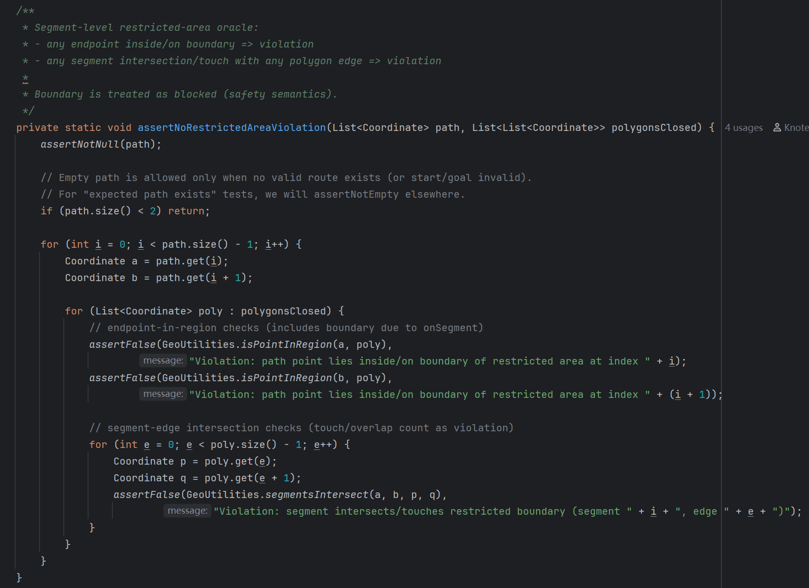
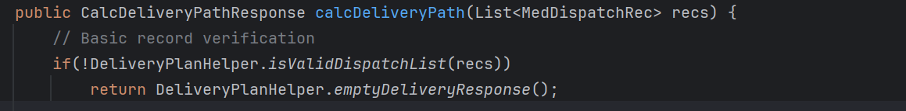
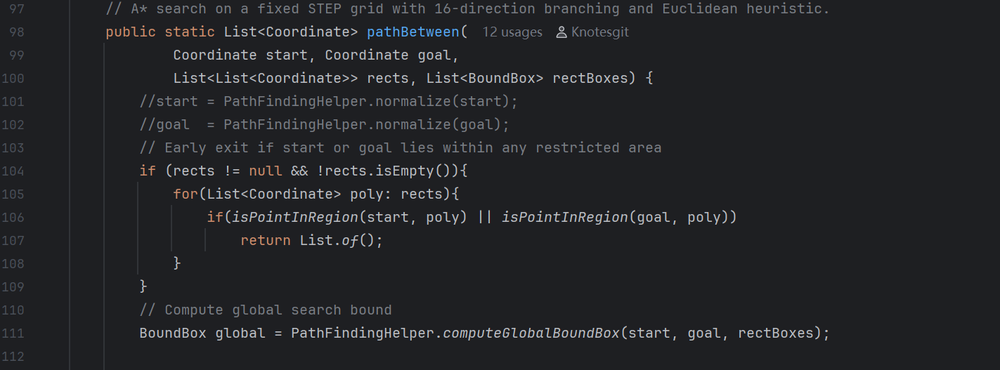
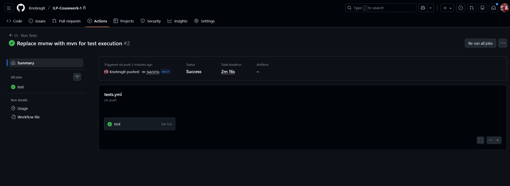

# LO5 Evidence — Test process improvement and automation

## Scope
This document records evidence for Learning Outcome 5, focusing on review/inspection
activities and the integration of automated testing into a continuous integration (CI)
process to address limitations identified in earlier testing.

## 1. Review / inspection evidence

### Purpose
The purpose of this review is to examine selected parts of the production software
implementation in order to identify structural limitations that are not reliably
exposed by executed tests. The review focuses on risks arising from oracle design,
observability boundaries, and reliance on implicit assumptions, which may reduce
the confidence that can be placed in testing outcomes even when automated tests
pass.

---

### Review approach
A lightweight inspection of the software code was performed as a complement to the
automated testing carried out in LO3.  
The review focused on:

- the independence and trustworthiness of system-level test oracles,
- the visibility of internal decision behaviour in core algorithms,
- reliance on assumptions not independently validated by tests.

The inspection targeted implementation areas central to system correctness, where
failures are difficult to diagnose or may be masked by the structure of the testing
process.

---

### Findings

**Finding 1 — Oracle dependence**
Inspection of the implementation and corresponding system-level tests shows that
certain correctness properties are evaluated using oracle logic that is not fully
independent from the system logic under test. In particular, geometric and
constraint-related computations used to determine path validity are structurally
shared between the implementation and the test oracle.

This introduces a risk that defects in the shared computation logic may be
consistently masked: if the underlying logic is incorrect, both the system and the
oracle may reproduce the same erroneous behaviour, causing system-level tests to
pass despite the presence of faults. This limitation reflects a test architecture
risk rather than insufficient test coverage.

---

**Finding 2 — Limited observability of internal decision state**
Review of the production code shows that multiple distinct delivery-plan failure
causes are collapsed into a single externally observable outcome. At the service
entry point, any validation failure of the dispatch list results in an immediate
return of an empty delivery response, regardless of the underlying reason for the
failure.

Within the corresponding validation logic, a range of semantically different
failure conditions are evaluated (e.g. null records, missing identifiers,
inconsistent requirement combinations), but all are mapped to the same boolean
outcome. As a result, downstream logic and automated tests can observe only whether
planning succeeded or failed, not why it failed.

This collapse of failure causes limits the observability of internal decision
state at the service boundary. System-level tests are therefore unable to
distinguish between fundamentally different validation failures that lead to the
same empty response, reducing diagnostic precision and confidence in test outcomes
for delivery-planning behaviour.

---

**Finding 3 — Implicit preconditions not independently validated**
Inspection of the pathfinding entry logic shows reliance on implicit preconditions
about the validity and interpretability of input coordinates and constraint data.
In particular, the implementation assumes that start and goal coordinates and
restricted-area polygons are well-formed and numerically stable, and it performs
restricted-area membership checks immediately on entry.

When these checks are triggered, the implementation returns an empty path
immediately. This collapses distinct underlying causes into the same observable
outcome (empty path), including cases where the start or goal genuinely violates a
restriction and cases where data quality or numeric edge conditions cause
membership checks to behave unexpectedly. The entry logic also proceeds to compute
global search bounds directly from the input coordinates, reinforcing the reliance
on upstream correctness rather than defensive validation at this level.

As a result, system-level tests can observe only that an empty path was produced,
but cannot reliably distinguish between legitimate constraint-triggered failure
and failures caused by violated implicit assumptions, reducing diagnostic precision
and the confidence that test success implies correctness under broader conditions.

---

### Implications
These findings indicate that the main limitations of the current testing process arise
from oracle trust, observability boundaries, and unverified assumptions. Review and
inspection therefore provide complementary assurance by exposing risks that are
structurally invisible to executed tests.

---

## 2. CI pipeline design

### Purpose
The CI pipeline is designed to integrate automated testing into the development workflow,
ensuring that test execution is repeatable, non-interactive, and consistently triggered
by code changes.

---

### Pipeline structure
The pipeline follows a minimal and deterministic structure:
1. Source checkout
2. Environment setup (JDK and build tooling)
3. Automated test execution
4. Pass/fail reporting

The pipeline is triggered on each push and pull request, ensuring that all changes are
subject to the same automated checks before integration.

---

### Design rationale
The pipeline deliberately prioritises reliability and clarity over complexity. By
limiting the pipeline to essential build and test stages, failures can be directly
attributed to code or test regressions rather than pipeline-specific behaviour. This
supports efficient regression detection and reduces the risk of false alarms caused by
overly complex automation.

---

## 3. Automated checks integrated into the pipeline

### Scope of automation
The CI pipeline integrates automated execution of the existing test suite as a
regression-checking mechanism. On each pipeline run, all implemented unit,
integration, and system tests are executed automatically, providing immediate
feedback on behavioural regressions introduced by code changes.

---

### Rationale for selected checks
Automated test execution is prioritised because it is repeatable, deterministic,
and directly aligned with the testing objectives defined in earlier learning
outcomes. Integrating these tests into CI ensures that previously validated
behaviour is continuously re-checked without manual intervention.

Other quality activities, such as exploratory testing or review-based inspection,
are not automated, as their effectiveness depends on human judgement rather than
mechanical repetition. These activities are therefore treated as complementary
techniques rather than candidates for automation.

---

### Limitations of automation
While CI automation improves consistency and regression detection, it does not
address the structural limitations identified through review, such as oracle
dependence or limited observability of internal decision states. Automated checks
therefore strengthen discipline and repeatability but do not eliminate the need
for inspection and higher-level reasoning.

---

## 4. Evidence that the pipeline operates as intended

A CI run triggered by a repository push demonstrates that automated test execution is
successfully integrated into the development workflow. The pipeline executes the
configured test suite without manual intervention and produces a clear pass/fail
outcome, providing immediate feedback on regressions introduced by code changes.

The recorded CI execution confirms that testing is consistently and repeatably applied
to all changes, supporting disciplined regression checking rather than ad hoc or
developer-dependent test execution.

